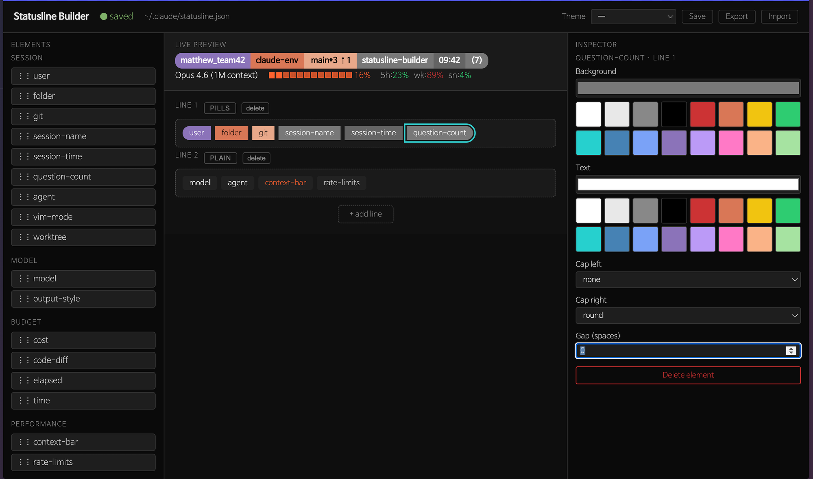

# Statusline Builder 사용 가이드

Claude Code 상태줄(`~/.claude/statusline.json`)을 드래그&드롭으로 조합하는 웹 UI.



---

## 실행

```bash
# 직접 실행
node statusline-builder/server.mjs

# 또는 심링크가 설치된 경우
statusline-builder
```

브라우저에서 http://127.0.0.1:7890 접속.

---

## 화면 구조

```
┌──────────────────────────────────────────────────────┐
│  Header: 저장 상태 · Theme 드롭다운 · Save/Export/Import │
├──────────┬───────────────────────┬───────────────────┤
│          │  LIVE PREVIEW         │                   │
│ PALETTE  │  ─────────────────    │  INSPECTOR        │
│ (Elements│  CANVAS               │  (선택된 엘리먼트   │
│  목록)   │  Line 1 ──────────    │   설정)           │
│          │  Line 2 ──────────    │                   │
│          │  + add line           │                   │
└──────────┴───────────────────────┴───────────────────┘
```

---

## 기본 사용 흐름

### 1. 라인 추가
캔버스 하단의 **+ add line** 클릭 → 새 라인 생성.

### 2. 엘리먼트 추가
팔레트에서 원하는 엘리먼트를 캔버스의 라인 위로 **드래그&드롭**.

### 3. 엘리먼트 순서 변경
캔버스에서 칩(chip)을 드래그해 같은 라인 내 다른 위치로 이동.

### 4. 엘리먼트 설정
캔버스에서 칩을 클릭 → 우측 **INSPECTOR**에서 색상·캡 스타일·옵션 편집.

### 5. 자동 저장
변경 즉시 `~/.claude/statusline.json`에 자동 저장. 헤더의 `●` 표시:
- **노랑** — 저장 중
- **초록** — 저장 완료
- **빨강** — 저장 실패

---

## 라인 스타일

각 라인은 **PILLS** 또는 **PLAIN** 두 가지 스타일 중 하나.  
라인 좌측의 `PILLS` / `PLAIN` 버튼을 클릭해 토글.

| 스타일 | 설명 |
|--------|------|
| **PILLS** | 각 엘리먼트가 배경색·캡 글리프를 가진 독립 pill로 렌더링 |
| **PLAIN** | 엘리먼트를 ANSI 텍스트로 공백 구분해 나열 |

---

## 엘리먼트 목록

### Session
| ID | 표시 예 | 설명 |
|----|---------|------|
| `user` | `matthew_team42` | 현재 시스템 사용자명 |
| `folder` | `claude-env` | 작업 디렉토리 폴더명 |
| `git` | `main*3 ↑1` | 브랜치명 + dirty 수 + ahead/behind |
| `session-name` | `statusline-builder` | `/rename` 등으로 설정된 세션 이름 |
| `session-time` | `09:42` | 세션 시작 시각 |
| `question-count` | `(7)` | 이번 세션의 사용자 메시지 수 |
| `agent` | `agent:planner` | 활성 에이전트명 |
| `vim-mode` | `[INSERT]` | Vim 모드 상태 |
| `worktree` | `wt1(feat)` | git worktree 이름·브랜치 |

### Model / Output
| ID | 표시 예 | 설명 |
|----|---------|------|
| `model` | `Opus 4.6 (1M context)` | 현재 모델 · 컨텍스트 크기 |
| `output-style` | `style:explanatory` | 기본 이외의 출력 스타일 |

### Performance
| ID | 표시 예 | 설명 |
|----|---------|------|
| `context-bar` | `███░░░░░░░░░ 16%` | 컨텍스트 사용률 바 |
| `rate-limits` | `5h:23% wk:89% sn:4%` | 5h/7d/Sonnet 사용률 (초록→노랑→빨강) |
| `cost` | `$4.2266` | 세션 누적 비용 (USD) |
| `elapsed` | `24m` | 세션 경과 시간 |
| `time` | `24m32s / 5m57s` | 총 시간 / API 응답 시간 |
| `code-diff` | `+101 / -10` | 추가·삭제 라인 수 |

---

## Inspector — 엘리먼트 설정

엘리먼트를 클릭하면 우측 INSPECTOR에 해당 엘리먼트의 설정이 표시된다.

### PILLS 스타일 전용

| 설정 | 설명 |
|------|------|
| **Background** | 배경색 (컬러 피커 + 16 프리셋) |
| **Text** | 글자색 (컬러 피커 + 16 프리셋) |
| **Cap left** | 왼쪽 캡 모양: `round` / `slant` / `arrow` / `square` / `none` |
| **Cap right** | 오른쪽 캡 모양 (같은 옵션) |
| **Gap (spaces)** | 다음 엘리먼트까지 간격 (0–10 칸) |

**캡 스타일 예시**

| 값 | 모양 |
|----|------|
| `round` | `` …텍스트…  |
| `slant` | `╱…텍스트…╲` |
| `arrow` | `◀…텍스트…▶` |
| `square` | `[…텍스트…]` |
| `none` | `…텍스트…` (캡 없음) |

> **왼쪽만 / 오른쪽만 둥글게**: Cap left = `round`, Cap right = `square` 조합 등 자유롭게 설정 가능.

### PLAIN 스타일 전용

| 설정 | 설명 |
|------|------|
| **Font color** | 글자색 (렌더러 내부 색상을 완전히 대체) |

### 엘리먼트별 추가 옵션

일부 엘리먼트는 타입별 전용 옵션이 있다.

| 엘리먼트 | 옵션 | 기본값 |
|----------|------|--------|
| `model` | Show version (체크박스) | on |
| `cost` | Precision (숫자) | 4 |
| `context-bar` | Width (숫자, 칸 수) | 20 |
| `rate-limits` | Show (5h/wk/sn/op 체크박스) | 5h, wk, sn |
| `session-name` | Max length | 30 |

---

## 테마

### 프리셋 적용
헤더의 **Theme** 드롭다운에서 선택 → 현재 PILLS 엘리먼트 색상에 즉시 적용.

기본 제공 테마:
- Claude Brand, Monochrome, Tokyo Night, Dracula, Solarized Dark, Catppuccin Mocha

### 현재 설정을 테마로 저장
**Save** 버튼 → 이름 입력 → `statusline-builder/themes/<이름>.json`으로 저장.  
저장된 테마는 드롭다운에 즉시 추가된다.

### 내보내기 / 가져오기
- **Export** — 현재 색상을 JSON 파일로 다운로드 (다른 머신에서 Import 가능)
- **Import** — JSON 파일을 불러와 색상 적용

---

## Live Preview

상단 **LIVE PREVIEW** 패널은 실제 statusline이 Claude Code 터미널에서 어떻게 보일지를 미리 확인하는 영역.

- 변경 즉시 자동 업데이트 (디바운스 300ms)
- PILLS 스타일: CSS `border-radius`로 캡 모양 시각화
- PLAIN 스타일: ANSI 색상을 HTML로 변환해 표시
- 목업 데이터 사용 (실제 Claude 세션 데이터 대신):
  - 사용자명 = 시스템 사용자
  - git = `main*3 ↑1`
  - 세션 시간 = `09:42`, 질문 수 = `(7)`
  - 비용 = `$4.2266`, 컨텍스트 = `16%`, rate-limits = `5h:23% wk:89% sn:4%`

---

## 설정 파일 (`~/.claude/statusline.json`)

```json
{
  "version": 1,
  "lines": [
    {
      "style": "pills",
      "elements": [
        {
          "type": "user",
          "bg": "#8B73B9",
          "fg": "#ffffff",
          "capLeft": "round",
          "capRight": "round",
          "gap": 1
        },
        {
          "type": "git",
          "bg": "#E8A88A",
          "fg": "#000000",
          "capLeft": "round",
          "capRight": "square",
          "gap": 0
        }
      ]
    },
    {
      "style": "plain",
      "elements": [
        { "type": "cost" },
        { "type": "rate-limits", "opts": { "show": ["5h", "wk", "sn"] } }
      ]
    }
  ]
}
```

---

## 개발 / 테스트

```bash
# 테스트 실행
node --test statusline-builder/tests/*.test.mjs

# 다른 포트로 실행
STATUSLINE_BUILDER_PORT=8080 node statusline-builder/server.mjs

# 다른 설정 파일 경로로 빌더 실행
STATUSLINE_CONFIG_PATH=/tmp/test.json node statusline-builder/server.mjs
```
